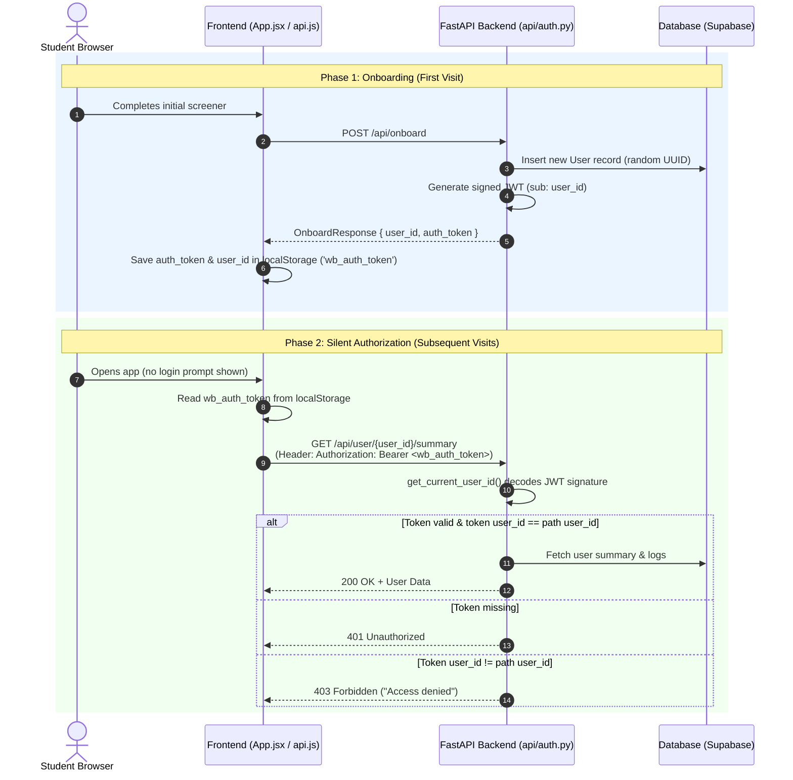

# Anonymous Device-Bound Authorization Architecture

> **Student Wellbeing Platform** · Security & Privacy Documentation

---

## 1. Executive Summary

The Student Wellbeing Platform uses **Anonymous Device-Bound Token Authorization**.

This authorization model solves a key conflict in digital mental health platforms:
* **The Product Requirement**: A private, low-friction **"Open Space"** where students check in daily without cumbersome username/password screens, emails, or PII collection.
* **The Security Requirement**: Absolute isolation of personal wellbeing data so that **no user can view or alter another student's logs**, even if they guess or discover another user's `user_id` (UUID).

---

## 2. How It Works

### Technical Flow



---

### Component Breakdown

1. **Token Generation (`api/auth.py` -> `create_access_token`)**:
   - Issued during `POST /api/onboard`.
   - Generates an `HS256` JWT signed with `JWT_SECRET`.
   - Payload:
     ```json
     {
       "sub": "<user_uuid>",
       "iat": 1774534800,
       "type": "device_bound_anonymous"
     }
     ```

2. **Backend Protection Dependencies (`api/auth.py`)**:
   - `get_current_user_id`: Extracts and verifies the HTTP `Authorization: Bearer <token>` header. Raises `401 Unauthorized` if invalid or missing.
   - `verify_user_access`: Compares the requested resource `user_id` with the authenticated `current_user_id`. Raises `403 Forbidden` if there is a mismatch.

3. **Protected API Routes**:
   - `POST /api/log`
   - `GET /api/user/{user_id}/summary`
   - `POST /api/safety-check`
   - `GET /api/user/{user_id}/due-safety-check`
   - `POST /api/agent/chat`
   - `GET /api/user/{user_id}/agent-nudge`

4. **Frontend Automatic Injection (`frontend/src/api.js` & `frontend/src/App.jsx`)**:
   - Saves `auth_token` to `localStorage.setItem('wb_auth_token', token)` upon completing onboarding.
   - The central `request()` helper in `api.js` automatically attaches `Authorization: Bearer ${token}` to all outgoing network requests.

---

## 3. Why It Works

1. **Cryptographic Guarantee (Signature Integrity)**:
   - A client cannot fake or alter the `user_id` inside the token because HMAC-SHA256 signature verification requires the server's private `JWT_SECRET`.
2. **Access Control Enforcement (401 / 403 Gates)**:
   - Unauthenticated requests receive `401 Unauthorized`.
   - Cross-account access attempts (e.g. User A trying to read `/api/user/UserB/summary`) receive `403 Forbidden`.
3. **Seamless Client Persistence**:
   - Web browsers persist `localStorage` across page reloads, tab closes, and browser restarts. The student remains seamlessly logged in on their device.

---

## 4. Why This Way Only (Design Rationale & Trade-offs)

### A. Preserving the "Open Space" Mental Health Philosophy
* **The Problem with Traditional Auth**: Requiring an email, password, or OAuth sign-in adds significant friction. For students experiencing burnout, anxiety, or depression, forced login screens create hesitation, fear of institutional tracking, and lower daily engagement.
* **The Anonymous Solution**: Device-bound anonymous authentication provides immediate, non-judgmental access the moment a student opens the website.

### B. Protecting Anonymous Identity (Zero PII)
* The system collects **zero Personally Identifiable Information (PII)** — no names, no email addresses, no phone numbers.
* Authentication is tied strictly to a cryptographically signed device secret rather than a personal identity.

### C. Eliminating ID Spoofing & Scraped Endpoints
* In unauthenticated designs, endpoints like `/api/user/{user_id}/summary` rely solely on the unguessability of UUIDs.
* If a student's `user_id` is exposed (e.g., via shared links or browser logs), anyone could query their logs.
* Device-bound token authorization closes this vector completely: knowing a student's `user_id` is useless without possessing their secret device token.

---

## 5. Emergency Recovery & Edge Cases

| Edge Case | Solution / Behavior |
|---|---|
| **Student clears browser storage** | Browser data wipe clears `localStorage`. The app gracefully prompts the user to start a fresh anonymous space. |
| **Optional Identity Export** | Students can optionally copy an "Export Secret Key" string from settings to transfer their space to another device without creating an account. |
| **Automated Background Sweeps** | Daily cron automation (`POST /api/automation/daily-sweep`) uses a separate server-to-server secret (`X-Automation-Secret`) to process background nudges safely. |
